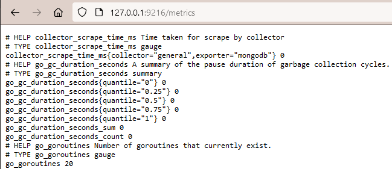

# CLC3 Group 7 - Monitoring with Prometheus and Grafana
## Introduction
In this project, we build a monitorable application, which will be deployed and monitored inside of a kubernetes cluster in Azure. The monitorable app is a Python REST API, which can create, get and delete notes stored in a MongoDB notes database. Prometheus is resonsible for scraping metrics from the app and Grafana is using these metrics to visualize them in dashboards. We also defined rules in Prometheus in oder to trigger Alerts via Slack.

## Responsibilities
The responsibilities changed since our proposal.

* Lukas: Building the monitorable application with Python and MongoDB and create deployment in kubernetes.
* Ines: Integrating Grafana to visualize metrics
* Severin: Responsible for setting up Prometheus with our custom application. Creating rules for metric alerts via Slack
* All: Basic setup of the kubernetes cluster with Prometheus and Grafana.

## Kubernetes Namespace overview
```
└── namespaces
    ├── monitoring
    └── mongodb
```
The ```monitoring``` namespace is responsible for Prometheus and Grafana, while all ressources of the MongoDB service and MongoDB app are stored within ```mongodb```.

## Setup
### Docker
We created a Dockerfile that can be used to build a Dockerimage. Port-forwarding for the container is needed in order to access the Prometheus and Grafana Dashboards
```
docker build .
docker run -it -p 9090:9090 <image_name> /bin/sh
```

### AKS setup
First, you have to login with your Azure account
```
az login
```
Next, set your Subscription and download your credentials
```
az account set --subscription <subscription_name>
az aks get-credentials --resource-group <rg_name> --name <cluster_name>
```
### Installing Prometheus and Grafana via Helm
Now we can execute a single command which installs Prometheus and Grafana via Helm Chart. Before that, let's create a namespace for the monitoring ressources
```
kubectl create ns monitoring
helm repo add prometheus-community https://prometheus-community.github.io/helm-charts
helm repo update
helm install monitoring prometheus-community/kube-prometheus-stack -n monitoring
```
After this, all pods, services and other ressources related to Prometheus and Grafana are deployed. By executing ```kubectl -n monitoring get all``` you can list all installed ressources.

### Port forwarding
To access the Prometheus Dashboard, following port-forward is used
```
kubectl port-forward -n monitoring pod/prometheus-monitoring-kube-prometheus-prometheus-0 9090
```
Attention: The name of the pod could be slightly different depending on the deployment name you chose.

Access Grafana Dashboard
```
kubectl port-forward -n monitoring pod/monitoring-grafana-6c7d669584-nqjk4 3000
```
**Attention**: Pod name might be slightly different.
In order to login to the Grafana Dashboard, use default username ```admin``` and password ```prom-operator```.

### MongoDB
First, a new namespace called mongodb and the bitnami packaged mongoDB helm chart is installed
```
kubectl create ns mongodb
helm install mongodb oci://registry-1.docker.io/bitnamicharts/mongodb -n mongodb
```
After installing, the port of the mongoDB service can be forwarded to access from outside the cluster on port 27017
```
kubectl port-forward --namespace mongodb svc/mongodb 27017:27017
```
In order to login to the database, you need to specify the username=```root``` and the password you get by executing the following commands
```
export MONGODB_ROOT_PASSWORD=$(kubectl get secret --namespace mongodb mongodb -o jsonpath="{.data.mongodb-root-password}" | base64 -d)
echo $MONGODB_ROOT_PASSWORD
```
To actually access the database, you can install the [MongoDB Compass](https://www.mongodb.com/try/download/compass) application on your desktop environment and connect to the exposed port. When entering a new connection go to "Advanced Connection Options", "Authentication", "Username/Password" and enter your credentials.


### MongoDB App

A custom REST api app with python was delevolped inside the [mongodb_app](mongodb_app) folder. In order to deploy the app to the kubernetes cluster, following steps have to be done, beginning with creating the Docker image. Open a terminal inside the [mongodb_app](mongodb_app) folder.
```
docker build -t <docker_hub_username>/mongodb-app:0.0.1 .
```
This will build a docker image with python and all dependencies installed. Now we push this image to DockerHub in order to connect it with kubernetes.
```
docker push <docker_hub_username>/mongodb-app:0.0.1
```
**Attention**: You have to change the image name specified in [deployment.yaml](mongodb_app/deployment.yaml) to ```<docker_hub_username>/mongodb-app:0.0.1```. Additionally, please change the MongoDB username and password in the ```env``` section.
Next, you can deploy the app to the kubernetes cluster.
```
kubectl apply -f deployment.yaml -n mongodb
```
After a few minutes when executing ```kubectl get pods -n mongodb```, you should see the status of the mongodb-app as READY. If that is not the case, you probably spelled the image name wrong in [deployment.yaml](mongodb_app/deployment.yaml) or when executing the command.

The app should be ready now, check this by executing a port forward.
```
kubectl port-forward service/mongodb-app 5000 -n mongodb
```
By opening "http://localhost:5000" in the browser, you should see the welcome message. On "http://localhost:5000/notes" all entries in the MongoDB database are listed.

With an API tool like Insomnia, POST, DELET and GET requests can be sent to the MongoDB API app on port 5000.
The following image shows the creation of a new note entry in the "notes" MongoDB database:


Additionaly, note entries can be deleted by making a DELETE request. All entries with the specified name will be deleted.


**Note**: POST and DELETE methods are located at localhost:5000/notes.
Finally, when visiting the site localhost:5000/notes in the browser, all stored note entries are displayed.
When visiting localhost:5000/notes/<name>, a filter on the person specified can be viewed:


### Activate prometheus-mongodb-exporter
First download mongodb-exporter and unzip it. (in our case, we created a directory beforehand where we downloaded it to)
```
wget https://github.com/percona/mongodb_exporter/releases/download/v0.40.0/mongodb_exporter-0.40.0.linux-amd64.tar.gz
tar xvzf mongodb_exporter-0.40.0.linux-amd64.tar.gz
```

The prometheus-mongodb-exporter chart is usually not activated to activate it the possible values to change can be checked by printing the values.yaml file from the chart into a new file called [mongodb.yaml](mongodb.yaml).
```
helm show values prometheus-community/prometheus-mongodb-exporter > mongodb.yaml
```
There is also the possiblity of installing mongodb-exporter if it is not installed yet, but this was not tested in our case.
Only a few lines have to be changed in the YAML file, therfore everything in here can be deleted and the following lines inserted.
```
mongodb:
  uri: "mongodb://<user>:<password>@mongodb.mongodb.svc.cluster.local:27017"

podAnnotations:
  prometheus.io/scrape: "true"
  prometheus.io/port: "9216"
  prometheus.io/path: /metrics

serviceMonitor:
  enabled: true
  interval: 20s
  namespace:
  additionalLabels:
    release: monitoring
```
Now the chart can be installed in a new release (important to not use the same release **"monitoring"** as before, otherwise the release will be overwritten). The changed mongodb.yaml file will be used to activate the service and pod.
```
helm install mongo-export prometheus-community/prometheus-mongodb-exporter --values=mongodb.yaml -n monitoring
```


If this port is now forwarded the new metrics from MongoDB can be viewed or the Prometheus UI on [http://localhost:9090/graph].
```
kubectl port-forward service/mongo-export-prometheus-mongodb-exporter 9216 -n monitoring
```



Additionally, the serviceMonitor is now in the "Targets" Tab on Prometheus [http://localhost:9090/targets]. This is from where the matrics are scraped.


At the end the ```kubectl -n monitoring get all``` command should show following output.


### Setup Slack workspace and channel
Create a new Slack workspace and a channel where the alerts should be posted to.
First a new Webhook will be added by adding a new app.


Look for "Incoming Webhook" or "Eingehende Webhooks" in german.


Select the channel where the alert should be posted to.


A new webhook URL will be created, which has to be saved to later add to the alertmanager.


### Setup alertmanager for Slack
To change the alertmanager create a file [alertmanager.yaml](alertmanager.yaml) with following content.
With the addition of the webhook url the alerts will now be sent to the selected Slack channel. Additionally, some formatting was added for the alert.
The most important attributes are the ```slack_api_url``` with the webhook link and the ```channel``` with the channel where the message will be sent to.
```
alertmanager:
  config:
    global:
      resolve_timeout: 2m
      slack_api_url: <webhook-link>
    route:
      group_by: ['namespace']
      group_wait: 30s
      group_interval: 2m
      repeat_interval: 5m
      receiver: 'slack-notifications'
      routes:
      - receiver: 'slack-notifications'
        matchers:
         - alertname = "SlackNotifications"
    receivers:
    - name: 'slack-notifications'
      slack_configs:
        - channel: '#<channel>'
          send_resolved: true
          icon_url: https://avatars3.githubusercontent.com/u/3380462
          title: |-
           [{{ .Status | toUpper }}{{ if eq .Status "firing" }}:{{ .Alerts.Firing | len }}{{ end }}] {{ .CommonLabels.alertname }} for {{ .CommonLabels.job }}
           {{- if gt (len .CommonLabels) (len .GroupLabels) -}}
             {{" "}}(
             {{- with .CommonLabels.Remove .GroupLabels.Names }}
               {{- range $index, $label := .SortedPairs -}}
                 {{ if $index }}, {{ end }}
                 {{- $label.Name }}="{{ $label.Value -}}"
               {{- end }}
             {{- end -}}
             )
           {{- end }}
          text: >-
           {{ range .Alerts -}}
           *Alert:* {{ .Annotations.title }}{{ if .Labels.severity }} - `{{ .Labels.severity }}`{{ end }}
      
           *Description:* {{ .Annotations.description }}
      
           *Details:*
             {{ range .Labels.SortedPairs }} • *{{ .Name }}:* `{{ .Value }}`
             {{ end }}
           {{ end }}
```

### Add new rules
To add new rules a new YAML file is created. The expressions use the values from the **mongodb-exporter**, which can also be testet at the Prometheus UI at [http://localhost:9090/graph].
* The first one sends an alert if there are more than 5 objects in the 'admin' database.
* The second and third one should send alerts if more than one isert is added in the last 10 seconds (does not work, maybe syntax of expression must be changed)

```
additionalPrometheusRulesMap:
  rule-name:
    groups:
    - name: mongodb-exporter
      rules:

      # Alert for too many objects in the database for 30s
      - alert: TooManyObjectsInDB
        expr: mongodb_dbstats_objects{database="admin"} > 5
        for: 30s
        labels:
          severity: critical
        annotations:
          summary: "Too many objects saved in the database."
          description: "There have been more than 5 objects in the database for the last 30s."

      # Alert for too many recent inserts in the collection
      - alert: TooManyRecentInserts
        expr: |
            increase(mongodb_top_insert_count{collection="notes",database="admin"}[10s]) > 1
        for: 0m
        annotations:
          summary: "Too many inserts (more than 5) in the last 10 seconds."
          description: "Too many inserts (more than 5) in the last 10 seconds."

      # Alert for too many recent queries in the collection
      - alert: TooManyRecentQueries
        expr: |
            increase(mongodb_top_queries_count{database="admin", collection="notes"}[10s]) > 1
        for: 0m
        annotations:
          summary: "Too many queries (more than 5) in the last 10 seconds."
          description: "Too many queries (more than 5) in the last 10 seconds."
```

Now the last two created files (alertmanager and the new alerts) can be added to the prometheus stack.
```
helm upgrade monitoring prometheus-community/kube-prometheus-stack -f mongodb_alerts.yaml -f alertmanager.yaml -n monitoring
```

If there are more than 5 objects in the database, an alert like this should be shown. The first one was added by prometheus-community, but the second one is the one we created.


## Grafana
(As previously mentioned, use to access the Grafana Dashboard via
```
kubectl port-forward -n monitoring pod/monitoring-grafana-6c7d669584-nqjk4 3000
```
**Attention**: Pod name might be slightly different.
In order to login to the Grafana Dashboard, use default username ```admin``` and password ```prom-operator```.)

### Connect to Prometheus
In order to visualize our metrics, click "Data sources" in the menu on the upper left:


Now click "Add a new data source" and choose "Prometheus".
Then, connect with the Prometheus server url and save the data source:


### Build a Dashboard
To create a dashboard, the menu can be navigated to "Dashboards":


After clicking "New" one can import an existing dashboard to build upon from https://grafana.com/grafana/dashboards/:


We choose the "Prometheus 2.0 Overview" dashboard: https://grafana.com/grafana/dashboards/3662-prometheus-2-0-overview/ and set our data source after loading it via id:


After opening the dashboard, new visualizations can be added with the button on the upper right: 


We first added a metric, filtered and set the minimum stepsize to one. After pressing "run queries" a graph is created:


On the right, one can choose the type and the visuals of the graph, e.g. toggling the Legend visibility:


### Alerts
Grafana can also add alerts the the graphs: 


To create an alert that fires if the amount of objects rises above 30, a reduce function and a threshold is required:


The alert additionally has to be stored in a folder and added to an evalaluation group and can then be saved:


The results (after changing some visuals like the color palette) look like this:


### Transformations
The data can also be transformed. 

We created a new graph: the metrics stayed the same as before but the graph type was changed to "Table":


To show the highest 10 amount of objects and their latest timestamps, the timestamps were formated, grouped, sorted and limited:


The menu on the right was used to enable filters and lookup menus (via hovering a data point) as well as the design changes including pages:


### Results
A few graphs later, our end result looks like this:


Thanks to the template we used, there are additional metrics like Uptime, Memory Chunks, Upness and a graph how many series are created and deleted over time:


# Appendix
## Lessons learned
- Tutorials are often not up to date as the technology changed very frequently.
- The update process of a kubernetes deployment is only triggered when e.g. the image tag in the container section is changed
- When deploying an image into kubernetes, the image must be accessible for kubernetes (e.g. by pushing it to DockerHub)
- Many concepts of kubernetes had been enforced during this project: namespaces, services, access services from inside the cluster (with DNS names), deployments, pods, ...
- Go through the whole values.yaml file and check if the value you need is in there ...
- Minimize Azure costs by stopping the kubernetes cluster ;)
  
## Research
### Prometheus
- https://logz.io/blog/mongodb-monitoring-prometheus-best-practices/ 
- https://www.youtube.com/watch?v=HwB2oWUdoT4
- https://shailender-choudhary.medium.com/monitor-azure-kubernetes-service-aks-with-prometheus-and-grafana-8e2fe64d1314
- https://www.opsramp.com/guides/prometheus-monitoring/prometheus-alerting/
- https://devopscube.com/prometheus-alert-manager/
- https://grafana.com/blog/2020/02/25/step-by-step-guide-to-setting-up-prometheus-alertmanager-with-slack-pagerduty-and-gmail/
- https://prometheus.io/
- https://github.com/prometheus-community/helm-charts
- https://www.youtube.com/watch?v=bTxD4yoeJQ8
- https://shailender-choudhary.medium.com/monitor-azure-kubernetes-service-aks-with-prometheus-and-grafana-8e2fe64d1314
- https://youtu.be/QoDqxm7ybLc?si=FziCZFbuqsbZ2e6D
- https://youtu.be/h4Sl21AKiDg?si=48mvdHWQXQ5hj-5E

### Grafana
- https://grafana.com/docs/grafana/v9.0/dashboards/export-import/
- https://www.youtube.com/watch?v=bTxD4yoeJQ8
- https://shailender-choudhary.medium.com/monitor-azure-kubernetes-service-aks-with-prometheus-and-grafana-8e2fe64d1314
- https://grafana.com/docs/grafana-cloud/monitor-infrastructure/kubernetes-monitoring/navigate-k8s-monitoring/#navigate-to-kubernetes-monitoring
- https://thriftly.io/docs/components/Thriftly-Deployment-Beyond-the-Basics/Metrics-Prometheus/Install-Create-Dashboard-Grafana.html

### MongoDB
* MongoDB service is installed via following Helm Chart: https://bitnami.com/stack/mongodb/helm

### MongoDB App
* The following code on GitHub was used for ideas how to make a REST API with Flask: https://gist.github.com/mmontone/370a43f4601a85abed3b37214586f21d
* Ideas were also dadapted from a MongoDB blog: https://www.mongodb.com/developer/languages/python/flask-python-mongodb/
* Documentation of PyMongo can be found here: https://www.mongodb.com/docs/drivers/pymongo/
* This YouTube tutorial was also used: https://www.youtube.com/watch?v=3wNvKybVyaI&t=1246s&ab_channel=NeuralNine
