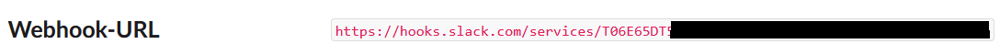

# CLC3 Group 7 - Monitoring with Prometheus and Grafana
## Setup
### Docker
We created a Dockerfile that can be used to build a Dockerimage. Port-forwarding for the container is needed in order to access the Prometheus and Grafana Dashboards
```
docker build .
docker run -it -p 9090:9090 <image_name> /bin/sh
```

### AKS setup
First, you have to login with your Azure account
```
az login
```
Next, set your Subscription and download your credentials
```
az account set --subscription <subscription_name>
az aks get-credentials --resource-group <rg_name> --name <cluster_name>
```
### Installing Prometheus and Grafana via Helm
Now we can execute a single command which installs Prometheus and Grafana via Helm Chart. Before that, let's create a namespace for the monitoring ressources
```
kubectl create ns monitoring
helm repo add prometheus-community https://prometheus-community.github.io/helm-charts
helm repo update
helm install monitoring prometheus-community/kube-prometheus-stack -n monitoring
```
After this, all pods, services and other ressources related to Prometheus and Grafana are deployed. By executing ```kubectl -n monitoring get all``` you can list all installed ressources.

### Port forwarding
To access the Prometheus Dashboard, following port-forward is used
```
kubectl port-forward -n monitoring pod/prometheus-monitoring-kube-prometheus-prometheus-0 9090
```
Attention: The name of the pod could be slightly different depending on the deployment name you chose.

Access Grafana Dashboard
```
kubectl port-forward -n monitoring pod/monitoring-grafana-6c7d669584-nqjk4 3000
```
**Attention**: Pod name might be slightly different
In order to login to the Grafana Dashboard, use default username ```admin``` and password ```prom-operator```.

### MongoDB
First, a new namespace called mongodb and the bitnami packaged mongoDB helm chart is installed
```
kubectl create ns mongodb
helm install mongodb oci://registry-1.docker.io/bitnamicharts/mongodb -n mongodb
```
After installing, the port of the mongoDB service can be forwarded to access from outside the cluster on port 27017
```
kubectl port-forward --namespace mongodb svc/mongodb 27017:27017
```
In order to login to the database, you need to specify the username=```root``` and the password you get by executing the following commands
```
export MONGODB_ROOT_PASSWORD=$(kubectl get secret --namespace mongodb mongodb -o jsonpath="{.data.mongodb-root-password}" | base64 -d)
echo $MONGODB_ROOT_PASSWORD
```
To actually access the database, you can install the [MongoDB Compass](https://www.mongodb.com/try/download/compass) application on your desktop environment and connect to the exposed port. When entering a new connection go to "Advanced Connection Options", "Authentication", "Username/Password" and enter your credentials.


### Activate prometheus-mongodb-exporter
First download mongodb-exporter and unzip it. (in our case, we created a directory beforehand where we downloaded it to)
```
wget https://github.com/percona/mongodb_exporter/releases/download/v0.40.0/mongodb_exporter-0.40.0.linux-amd64.tar.gz
tar xvzf mongodb_exporter-0.40.0.linux-amd64.tar.gz
```

The prometheus-mongodb-exporter chart is usually not activated to activate it the possible values to change can be checked by printing the values.yaml file from the chart into a new file called [mongodb.yaml](mongodb.yaml).
```
helm show values prometheus-community/prometheus-mongodb-exporter > mongodb.yaml
```
There is also the possiblity of installing mongodb-exporter if it is not installed yet, but this was not tested in our case.
Only a few lines have to be changed in the YAML file, therfore everything in here can be deleted and the following lines inserted.
```
mongodb:
  uri: "mongodb://<user>:<password>@mongodb.mongodb.svc.cluster.local:27017"

podAnnotations:
  prometheus.io/scrape: "true"
  prometheus.io/port: "9216"
  prometheus.io/path: /metrics

serviceMonitor:
  enabled: true
  interval: 20s
  namespace:
  additionalLabels:
    release: monitoring
```
Now the chart can be installed in a new release (important to not use the same release **"monitoring"** as before, otherwise the release will be overwritten). The changed mongodb.yaml file will be used to activate the service and pod.
```
helm install mongo-export prometheus-community/prometheus-mongodb-exporter --values=mongodb.yaml -n monitoring
```


If this port is now forwarded the new metrics from MongoDB can be viewed there.
```
kubectl port-forward service/mongo-export-prometheus-mongodb-exporter 9216 -n monitoring
```


Additionally, the serviceMonitor is now in the "Targets" Tab on Prometheus [http://localhost:9090/targets]


### Add a new rule


### Setup Slack workspace and channel
Create a new Slack workspace and a channel where the alerts should be posted to.
First a new Webhook will be added by adding a new app.


Look for "Incoming Webhook" or "Eingehende Webhooks" in german.


Select the channel where the alert should be posted to.


A new webhook URL will be created, which has to be saved to later add to the alertmanager.



### Setup alertmanager for Slack
To change the alertmanager create a file [alertmanager.yaml](alertmanager.yaml) with following content.
With the addition of the webhook url the alerts will now be sent to the selected Slack channel. Additionally, some formatting was added for the alert.
```
alertmanager:
  config:
    global:
      resolve_timeout: 2m
      slack_api_url: <webhook url>
    route:
      group_by: ['namespace']
      group_wait: 30s
      group_interval: 2m
      repeat_interval: 5m
      receiver: 'slack-notifications'
    receivers:
    - name: 'slack-notifications'
      slack_configs:
        - channel: '#<channel name>'
          send_resolved: true
          icon_url: https://avatars3.githubusercontent.com/u/3380462
          title: |-
           [{{ .Status | toUpper }}{{ if eq .Status "firing" }}:{{ .Alerts.Firing | len }}{{ end }}] {{ .CommonLabels.alertname }} for {{ .CommonLabels.job }}
           {{- if gt (len .CommonLabels) (len .GroupLabels) -}}
             {{" "}}(
             {{- with .CommonLabels.Remove .GroupLabels.Names }}
               {{- range $index, $label := .SortedPairs -}}
                 {{ if $index }}, {{ end }}
                 {{- $label.Name }}="{{ $label.Value -}}"
               {{- end }}
             {{- end -}}
             )
           {{- end }}
          text: >-
           {{ range .Alerts -}}
           *Alert:* {{ .Annotations.title }}{{ if .Labels.severity }} - `{{ .Labels.severity }}`{{ end }}
      
           *Description:* {{ .Annotations.description }}
      
           *Details:*
             {{ range .Labels.SortedPairs }} • *{{ .Name }}:* `{{ .Value }}`
             {{ end }}
           {{ end }}
```

Upgrade the **prometheus-community/kube-prometheus-stack** chart with the **"monitoring"** release.
```
helm upgrade monitoring prometheus-community/kube-prometheus-stack --values=alertmanager.yaml -n monitoring
```

### MongoDB App

A custom REST api app with python was delevolped inside the [mongodb_app](mongodb_app) folder. In order to deploy the app to the kubernetes cluster, following steps have to be done, beginning with creating the Docker image. Open a terminal inside the [mongodb_app](mongodb_app) folder.
```
docker build -t <docker_hub_username>/mongodb-app:0.0.1 .
```
This will build a docker image with python and all dependencies installed. Now we push this image to DockerHub in order to connect it with kubernetes.
```
docker push <docker_hub_username>/mongodb-app:0.0.1
```
**Attention**: You have to change the image name specified in [deployment.yaml](mongodb_app/deployment.yaml) to ```<docker_hub_username>/mongodb-app:0.0.1```.
Next, you can deploy the app to the kubernetes cluster.
```
kubectl apply -f deployment.yaml -n mongodb
```
After a few minutes when executing ```kubectl get pods -n mongodb```, you should see the status of the mongodb-app as READY. If that is not the case, you probably spelled the image name wrong in [deployment.yaml](mongodb_app/deployment.yaml) or when executing the command.

The app should be ready now, check this by executing a port forward.
```
kubectl port-forward service/mongodb-app 5000 -n mongodb
```
By opening "http://localhost:5000" in the browser, you should see the welcome message. On "http://localhost:5000/notes" all entries in the MongoDB database are listed.

## Kubernetes Namespace overview
```
└── namespaces
    ├── monitoring
    └── mongodb
```
The ```monitoring``` namespace is responsible for Prometheus and Grafana, while all ressources of the MongoDB service and MongoDB app are stored within ```mongodb```.
